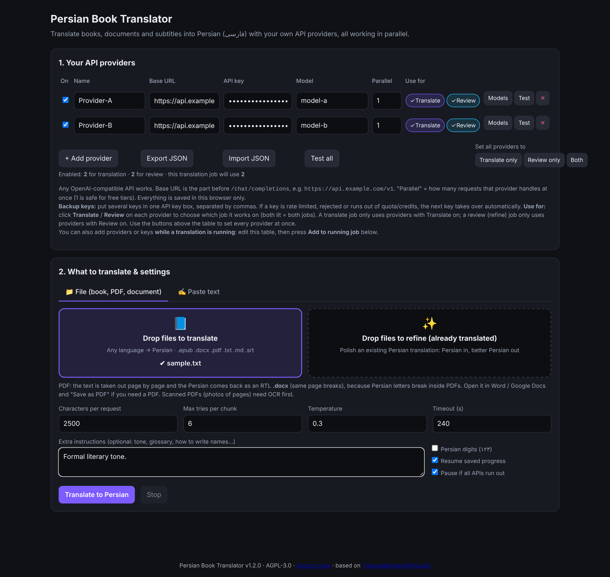
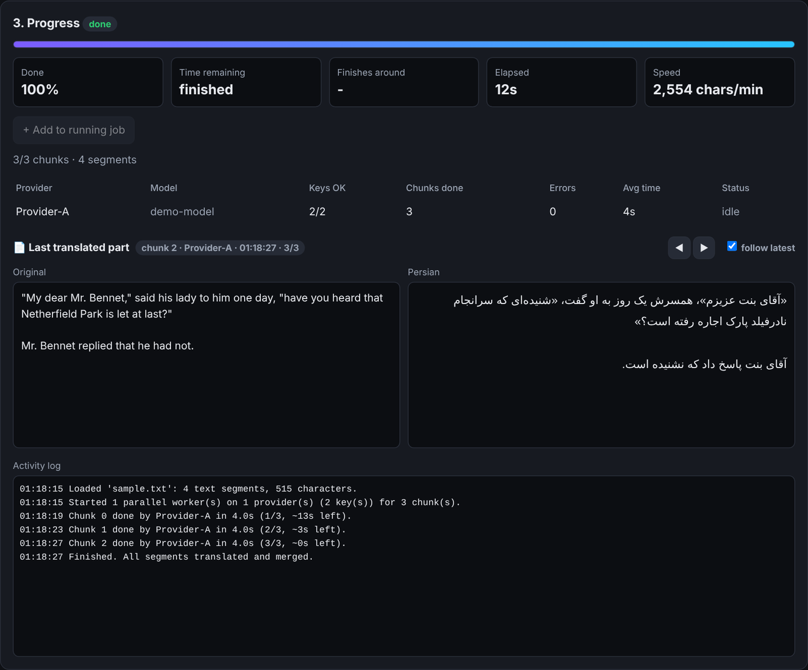

# Persian Book Translator | مترجم کتاب فارسی

**English** · [فارسی (راهنمای کامل)](README.fa.md) · [⬇ Download / دانلود](https://github.com/AriyanD/TranslateBooksWithLLMsToPersian/releases/latest)

<div dir="rtl" align="right">

## معرفی

**مترجم کتاب فارسی** برنامه‌ای است برای ترجمهٔ کتاب و سند به **فارسی** با **API های خودتان**.
فایل‌های **EPUB، DOCX، PDF، TXT/MD و SRT** (یا حتی متن چسبانده‌شده) را می‌گیرد و همهٔ سرویس‌هایی که وارد کرده‌اید را
**هم‌زمان** روی یک کتاب به کار می‌گیرد؛ هر سرویس تکهٔ بعدی را برمی‌دارد و در پایان همه‌چیز به ترتیب اصلی در یک فایل
راست‌به‌چپ (مثلاً `mybook.fa.epub`) کنار هم قرار می‌گیرد. مدل لوکال ندارد و با هر سرویسی که فرمت OpenAI
(`/chat/completions`) را بفهمد کار می‌کند.

* **بدون نصب پایتون:** نسخهٔ **Standalone** برای Windows، macOS و Linux در بخش [Releases](https://github.com/AriyanD/TranslateBooksWithLLMsToPersian/releases/latest) است؛ دانلود، استخراج و دوبار کلیک.
* **سورس‌کد کامل** هم همین‌جا (و در Releases به‌صورت Source code) در دسترس است.
* ادامهٔ خودکار پس از قطعی، جایگزینی خودکار سرویس خراب، چند کلید پشتیبان، حالت **بازبینی ادبی (Refine)** و نمایش زندهٔ «آخرین بخش ترجمه‌شده».

راهنمای کامل به فارسی: [README.fa.md](README.fa.md)

</div>

---

## Screenshots

**Set up your providers, drop a book, press translate:**



**Live progress with time remaining and the original next to the Persian (screenshot of a short demo text):**



---

## English

Translate **EPUB, DOCX, PDF, TXT/MD and SRT** files (or just **pasted text**) into **Persian (فارسی)** using
**your own API providers**, all working **in parallel**.

* No built-in providers, no local models. You type each provider's **name, base URL, API key and model**.
* Works with anything that speaks the OpenAI `/chat/completions` format.
* The book is split into chunks. Every provider pulls the next free chunk, so
  each chunk is done by a different provider at the same time; faster providers take more.
* If a provider fails (rate limit, timeout, bad answer) the chunk is handed to another provider.
  Bad keys / wrong model names disable that provider automatically.
* At the end, all chunks are merged back in the original order into one file
  (`mybook.fa.epub`, `mybook.fa.docx`, ...), set to right-to-left.
* Progress is saved after every chunk. If it stops, start the same file again and it continues.
* Shows **time remaining**, expected finish time and speed, plus a **"Last translated part"** window
  (original next to Persian, ◀ ▶ to look at the last 5 parts).
* **Refine mode:** drop an *already translated* Persian file in **"Drop files to refine"** and it is
  polished by a Persian literary-editor prompt (more natural Persian, better word choice, نیم‌فاصله and
  punctuation fixed, leftover English translated). Output: `mybook.refined.fa.epub`. CLI: `--refine`.
* **Separate APIs for translation and review:** every provider has a **Use for** setting
  (**Translate**, **Review**, or both). A translate job only uses providers with Translate on, a
  review (refine) job only uses providers with Review on. Handy for e.g. a cheap fast model for the
  first translation and a stronger model for the Persian review pass. In JSON:
  `"use_for": ["translate"]`, `["review"]` or `["translate", "review"]` (missing = both).
* **Backup API keys:** several keys per provider (`key1, key2, key3`). Rate-limited, rejected or
  out-of-quota keys are skipped automatically.
* **Never loses the book when the APIs run dry:** if every key is dead or out of quota, the job
  *pauses* instead of failing. Add a provider/key while it is running and it continues immediately.

* **PDF input:** text is pulled out page by page, broken lines are glued back into paragraphs,
  repeated headers/footers are dropped, and the result is an RTL `mybook.fa.docx` with the same page
  breaks (Persian can't be written back into a PDF without breaking the letters; use "Save as PDF").
  Scanned PDFs need OCR first.
* **Paste text page:** the **✍️ Paste text** tab (or open `http://localhost:7860/#text`) lets you paste
  text, translate or refine it, then copy the Persian or save it as `.txt`. Uses the same providers & settings.

## Run it

```bash
pip install -r requirements.txt
python app.py                # web UI on http://localhost:7860
```

Or from the command line:

```bash
cp providers.example.json providers.json   # fill in your providers
python translate.py mybook.epub -p providers.json
```

Useful options: `--chunk-chars 2500` (size of one request), `--instructions "formal tone"`,
`--persian-digits`, `--max-attempts 6`, `--no-resume`, `--no-wait`,
`--refine` (input is already Persian: polish it instead of translating).

### Don't want to run it on your PC?

* **Google Colab:** open `PersianBookTranslator_Colab.ipynb` in Colab, upload this zip and your book, fill in providers, run.
* **Any server / Hugging Face Space / Render:** `docker build -t pbt . && docker run -p 7860:7860 pbt`.
  Set `PBT_PASSWORD=something` so strangers can't use your server; the UI will ask for it.

## Providers

| Field | Meaning |
|---|---|
| Name | Anything unique, used in logs |
| Base URL | The part before `/chat/completions`, e.g. `https://api.example.com/v1` (a full `.../chat/completions` URL also works) |
| API key | Sent as `Authorization: Bearer <key>` |
| Model | Model id for that provider (the **Models** button lists them if the provider supports `/models`) |
| Parallel | Simultaneous requests to that provider. Keep 1 for strict free tiers |
| Use for | **Translate**, **Review** or both: which job type this provider works on (JSON `use_for`, default both) |

Same provider with 2 different keys? Add it twice with different names.

In the web UI, providers live only in your browser (localStorage). Use **Export JSON** to
get a `providers.json` for the CLI.

## When a key runs out (quota / credits / token limit)

| What happens | What the app does |
|---|---|
| Key is rate limited (429, per-minute) | That key rests for the time the API asks; the next key/provider takes the chunk. Chunk is **not** counted as a failed try |
| Key is out of quota or credits (402, `insufficient_quota`, "per day", "Insufficient Balance"...) | Key is parked for 30 min (doubles each time, max 6 h), next key/provider takes over |
| Key rejected (401/403) | Key is dropped, the next key is used; provider disabled only if all its keys are rejected |
| **Everything** is dead or out of quota | Job status becomes **waiting**, nothing is thrown away. A yellow banner tells you |

Adding an API while it runs:

* **Web UI:** add a new row in step 1 (or add `, newkey` to an existing key box) and press
  **+ Add to running job**. Same name = new keys added to that provider; new name = new provider.
* **CLI:** edit `providers.json` and save it. The running job picks up the change within a few seconds.
* **Colab:** in a new cell, `job.add_providers([ProviderConfig.from_dict({...})])`.

Don't want it to wait? Untick **Pause if all APIs run out** (CLI: `--no-wait`); it then stops and
saves progress, and running the same file again continues from there.
The **Test** button checks every key of a provider and tells you which ones are dead or empty.

## Tips for free APIs

* Use 1500-3000 characters per request. Smaller chunks = more requests (hits rate limits faster), larger = models may skip text.
* Reasoning models' `<think>` blocks are stripped automatically.
* If some segments stay untranslated (all providers kept failing), just run the same file again: only those are retried.

## Formats

| Format | What is kept |
|---|---|
| EPUB | Chapters, images, links, CSS, table of contents. Each paragraph is translated as a whole, so inline bold/italic inside a paragraph is flattened. Book is set to `fa` + RTL |
| DOCX | Paragraphs, tables, headers/footers; each paragraph keeps its first run's formatting and is set RTL |
| SRT | Timings untouched; lines get an RTL mark so players show them correctly |
| TXT/MD | Paragraph layout |

## Project layout

```
app.py / translate.py      entry points (web / CLI)
ptranslator/providers.py   OpenAI-compatible client + error classification
ptranslator/dispatcher.py  parallel multi-provider queue, retries, failover, merge
ptranslator/prompts.py     Persian translation prompt + segment markers
ptranslator/job.py         one job: load, resume, dispatch, build output
ptranslator/formats/       epub, docx, srt, txt
ptranslator/web/index.html the UI
```

## Standalone app (no Python needed)

Download the zip for your system from the **[Releases](https://github.com/AriyanD/TranslateBooksWithLLMsToPersian/releases/latest)** page
(`Windows`, `macOS` or `Linux`), unzip, and double-click `PersianBookTranslator`.
Your browser opens the UI at `http://127.0.0.1:7860`; keep the black console window open
while translating. Saved progress lives in a `PersianBookTranslator_Data` folder next to the program.

* Windows may show a *SmartScreen* warning (the app is not code-signed): **More info -> Run anyway**.
* macOS: right-click the file -> **Open** the first time (or *System Settings -> Privacy & Security -> Open Anyway*).
* Linux: `chmod +x PersianBookTranslator && ./PersianBookTranslator`.
* Providers you typed into `localhost:7860` in an older install are not visible at `127.0.0.1:7860`
  (browsers keep them per address): use **Export JSON** there and **Import JSON** here.

Build it yourself: `pip install -r requirements.txt pyinstaller && python build_standalone.py`,
then check it with `dist/PersianBookTranslator --selftest`.
Releases are built (and self-tested) automatically by GitHub Actions when a tag such as `v1.2.0` is pushed.

## Origin and license

This project is a derivative of
[hydropix/TranslateBooksWithLLMs](https://github.com/hydropix/TranslateBooksWithLLMs)
(AGPL-3.0). The code was rewritten around a Persian-only workflow with many
free OpenAI-compatible API providers translating one book in parallel; there is no local-model
support. It stays under the same **GNU AGPL-3.0** license (see `LICENSE`). If you run a modified
version as a public web service, AGPL section 13 requires you to offer your users the source code;
the UI footer links to it.


